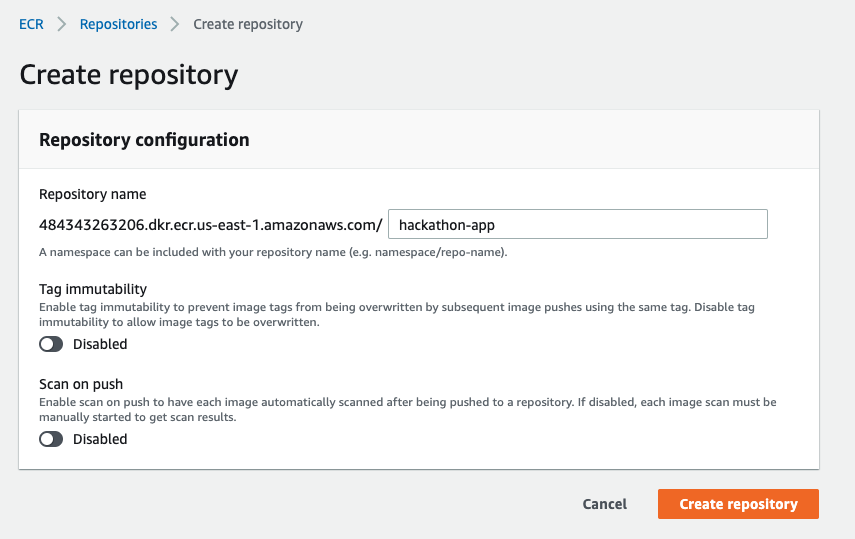
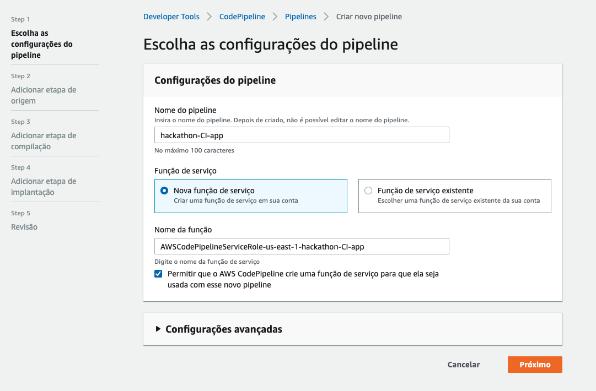
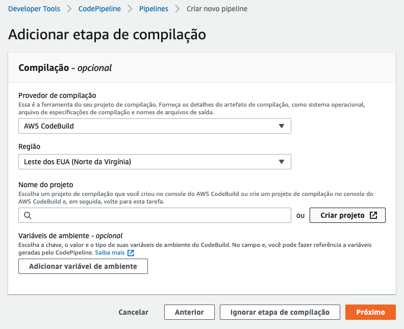
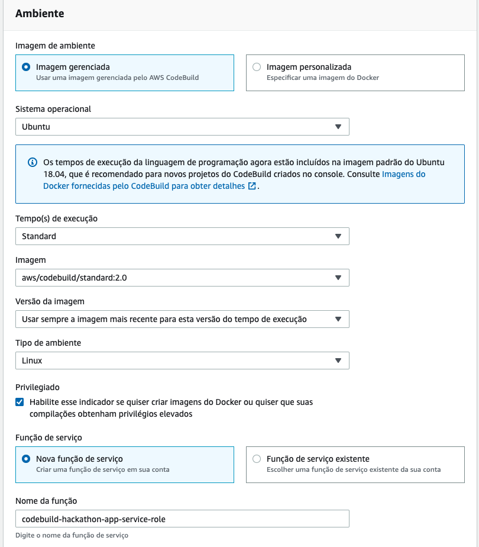
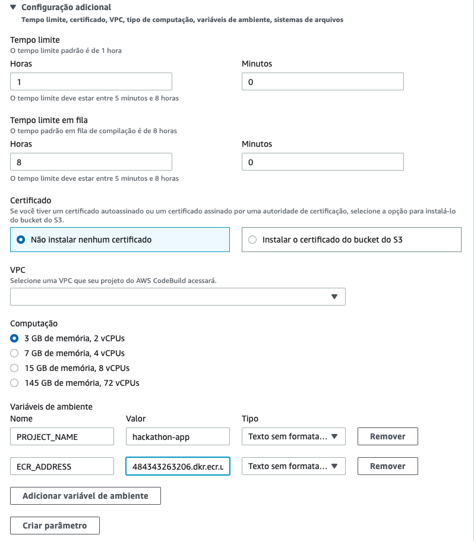
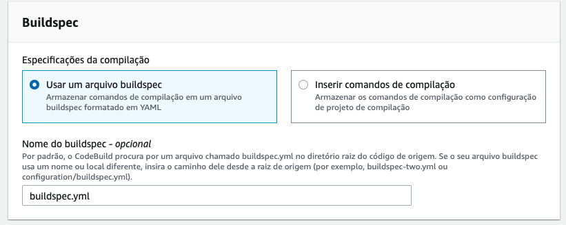
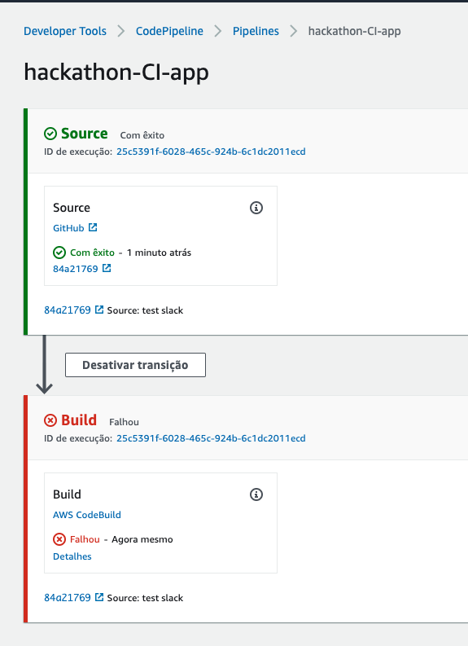
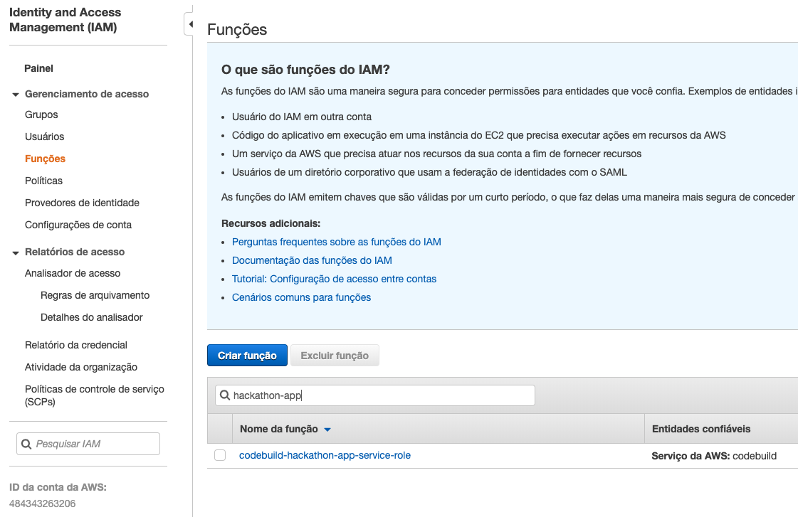
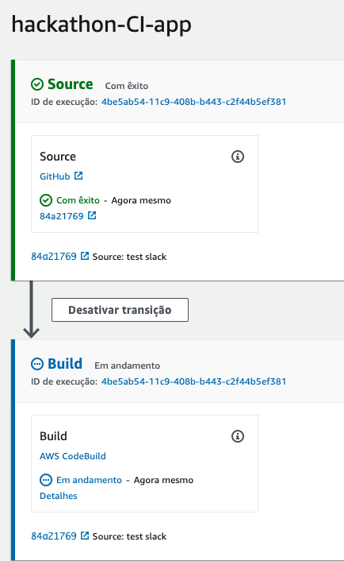

1. Primeiramente neste tutorial vamos criar o pipeline de integração continua que a cada commit da aplicação uma esteria seja executada para montar a nova imagem e colocar no docker Registry(ECR).
2. No IDE do CLoud9 verifique como esta o arquivo Hackaton-project-app/buildspec.yml para entender as fases do build da imagem.
3. Explore livremente os outros arquivos do repositório
4. Faça um fork do github do projeto 'vamperst/Hackaton-project-app' para sua conta para conectar no pipeline que iremos criar.
5. Em outra aba entre no console da AWS e vá para o serviço 'ECR', vamos criar o docker registry que receberá as imagens.
6. Clique 'Get Started'
7. Coloque o nome do repositório de `hackathon-app` e clique em 'create repository'
   
8. Em outra aba entre no console da AWS e vá para o serviço 'CodePipeline'
9.  Clique em 'Criar Pipeline'
10. Coloque o nome no pipeline de `hackathon-CI-app`, deixe as opções como na imagem e clique em próximo:
   
11. Em origem escolha o GitHub e conecte com sua conta como pedido na tela.
12. No repositório escolha o repositório `Hackaton-project-app` que esta na sua conta ,deixe as demais opções como na imagem e clique me próximo.
    
13. No provedor de compilação escolha 'AWS CodeBuild' e clique em 'Criar Projeto'. Uma janela para criar o projeto irá abrir.
    
14. De o nome de `hackathon-app` ao projeto.
15. Em Ambiente deixa as opções como na imagem:
    
16. Em configuração adicional são necessárias 2 variaveis de ambiente, PROJECT_NAME e ECR_ADDRESS, para o valor de ECR_ADDRESS copie a URI do repositório ECR que criou no passo 7.
    
17. Em Buildspec escreva o conteúdo `buildspec.yml` já que o arquivo de configuração está na raiz do nosso diretório.
    
18. Clique em 'Continuar para CodePipeline'
19. Devolta a tela do CodePipeline clique em 'Próximo'
20. Na tela implantação clique em 'Ignorar etapa implantação' e confirme.
21. Clique em 'Criar pipeline'
22. Ao criar o serviço irá tentar fazer a primeira execução e irá falhar. O erro ocorreu por uma falha na permissão do IAM.
    
23. Vamos arrumar isso, em uma nova aba vá no serviço IAM do console.
24. Do lado esquerdo clique em 'Funções' e digite 'hackathon-app' para achar a função criada pelo CodeBuild. Clique nela.
    
25. Clique em 'Anexar Políticas'
26. Selecione 'AdministratorAccess' e clique em 'Anexar Política'. Vale lembrar que só colocamos essa permissão porque é um exercício. Em nossas empresas teriamos que fazer uma politica personalizada apenas com as permissões necessárias. =)
27. Volte ao CodePipeline e clique em 'Lançar  alteração'
28. Quando a fase do CodeBuild ficar azul clique em 'Detalhes'
    
29. Clique em 'logs Finais' para acompanhar o que esta sendo feito.
30. Ao terminar você poderá notar no CodePipeline que tudo foi executado com sucesso.
31. Quando olhar no ECR verá que tem uma imagem no reposítorio. 
32. Caso queira testar a integração. Crie um arquivo no seu repositório e faça o commit para o guthub. 
