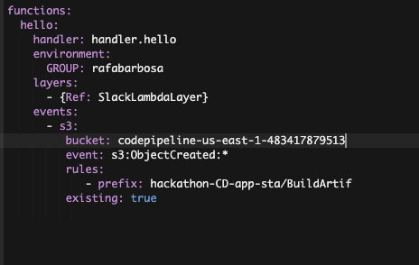
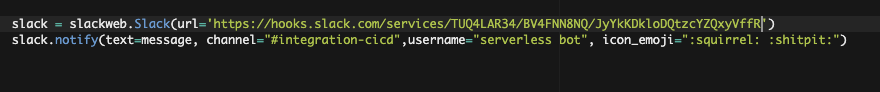
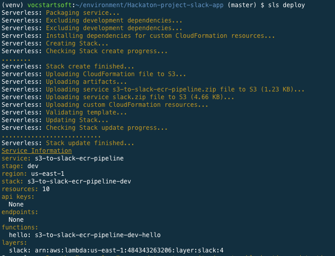
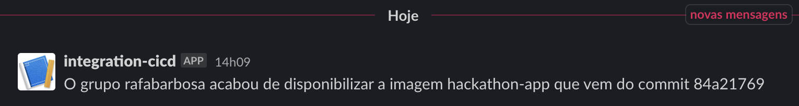
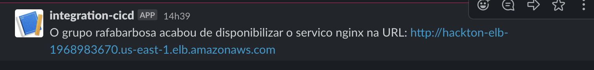

1. Agora vamos subir os avisos pelo slack que cada pipeline foi executado com sucesso.
2. Primeiro vamos executar o aviso de uma nova imagem do app no repositório. Para isso execute no terminal o comando `cd ~/environment/Hackaton-project-slack-app` para entrar na pasta
3. Não esqueça de ativar o virtualenv com os comados:
   ```
    python3 -m pip install --user virtualenv
    python3 -m venv ~/venv
    source ~/venv/bin/activate
   ```
4. crie a pasta de dependencias com o comando `mkdir layer`
5. Cerquifique de que o pacote wheel utilizado para fazer o setup do pacote slackweb esta instalado com o comando `pip install wheel`
6. Baixe as dependencias com o comando `pip3 install -r requirements.txt -t layer/`
7. No arquivo 'serverless.yml' da pasta Hackaton-project-slack-app altere via IDE a variavel GROUP com seu nome.
8. Em outra aba vá ao console do serviço S3 e copie o nome do bucket que inicia em `codepipeline-us-east-1-`.
9. No arquivo serverless.yml altere o bucket do evento do lambda para o correto, o que copiou no passo anterior.
    
10. No arquivo handler.py troque a URL e channel do slack pelo o que estão no dontpad com a descrição 'slack-app'
    
11. De volta ao terminal utilize o comando `sls deploy`
    
12. lance uma alteração com o pipeline `hackathon-CI-app` e recebe uma mensagem no slack ao fim do processo.
    
13. Sinta-se a vontade para mudar a mensagem, colocar gifs, etc...
14. Agora vamos colocar um aviso sobre o pipeline que sobe a stack com terraform. para tal utilize o comando `cd ~/environment/Hackaton-project-slack-stack/` para entrar na pasta correta.
15. Crie a pasta layer e baixe as dependências como no passo 7
16. Faça as mesmas alterações que foram feitas no passos 7,8 e 9 no serverless.yml da pasta 'Hackaton-project-slack-stack' 
17. No arquivo handler.py troque a URL e channel do slack pelo o que estão no dontpad com a descrição 'slack-stack'
18. Use o comando `sls deploy` para fazer o deploy da stack
19. Teste chamando a api de deploy da stack e esperando a mensagem no slack asism que acabar o pipeline
    
