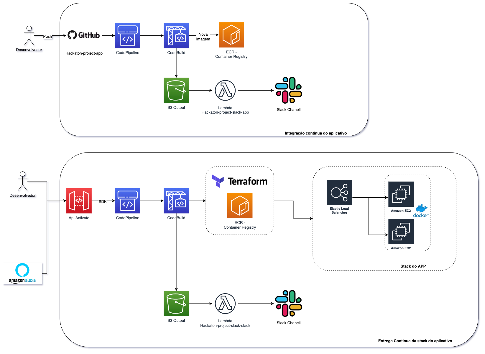

## Projeto Hackathon Infra as Code

1. Dentro do seu ambiente do cloud9 baixe todos os reposisórios de código para o projeto do hackaton:
   1. `git clone https://github.com/vamperst/Hackaton-project-app.git`
   2. `git clone https://github.com/vamperst/Hackaton-project-terraform-stack.git`
   3. `git clone https://github.com/vamperst/Hackaton-project-api-pipeline-stack.git`
   4. `git clone https://github.com/vamperst/Hackaton-project-slack-app.git`
   5. `git clone https://github.com/vamperst/Hackaton-project-slack-stack.git`
